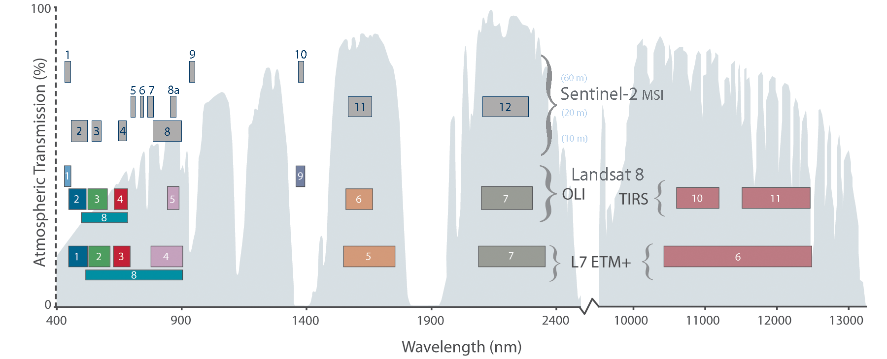

# Satélites- Colección de imagenes {#Sat}

VICAL utiliza las colecciones de imágenes de reflectancia de la superficie terrestre corregidas atmosféricamente de LandSat (misiones 4, 5, 7, 8 y 9, con imágenes desde 1982 hasta el presente) y Sentinel-2. 

En la Tabla \@ref(tab:Sat)  se muestra las características generales de estas colecciones de imágenes y el código de la colección de imágenes en GEE

```{r Sat, echo=FALSE, message=FALSE, warning=FALSE,}
Sensor<-c("Landsat-4 TM",	"Landsat-5 TM",	"Landsat-7 ETM+",	"Landsat-8 OLI",	"Landsat-9 OLI-2",	"Sentinel-2 (MSI)")
Dataset.availability <-c("22/08/1982 - 24/06/1993",	"16/03/1993 – 05/05/2012",	"01/01/1999-present",	"11/04/2013- present",	"31/10/2021- present",	"28/03/2017-present")
Collection.ID<-c("LANDSAT/LT04/C02/T1_L2",	"LANDSAT/LT05/C02/T1_L2",	"LANDSAT/ LC08 /C01/T1_L2",	"LANDSAT/LE07/C01/T1_L2",	"LANDSAT/LC09/C02/T1_L2",	"COPERNICUS/S2_SR_HARMONIZED")

Sat<-data.frame(Sensor, Dataset.availability, Collection.ID)

knitr::kable(
  Sat, booktabs = TRUE, 
  caption = 'Colección de imagenes Landsat y Sentinel de GEE considerados en VICAL'
) 
```

La ubicación de las diferentes bandas espectrales de estos sensores se muestra en la Figura \@ref(fig:figS1). 
```{r figS1, fig.cap='Comparación de Lansat y Sentinel-2 y ubicacion de las bandas espectrales. Los números indican el número de bandas espectrales consideradas en cada sensor.', echo=FALSE, message=FALSE, warning=FALSE, fig.align = 'center'}

```


