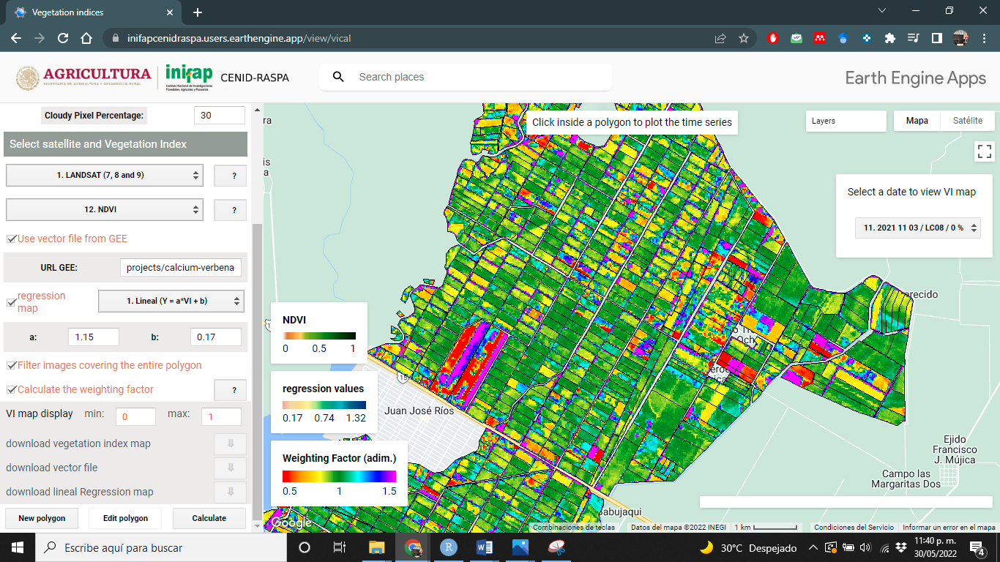
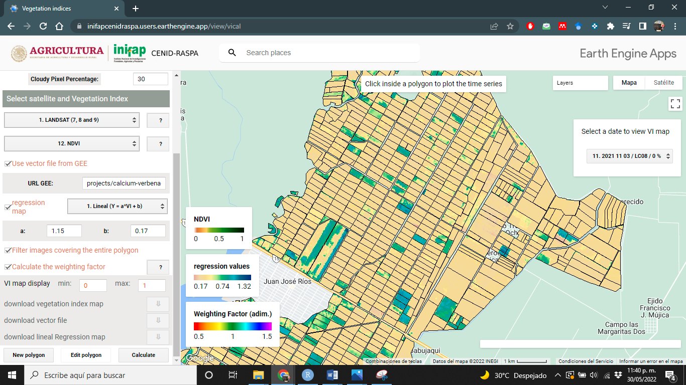
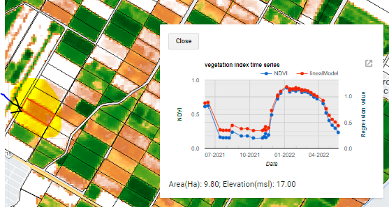
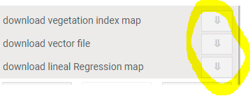

# Implementación

En esta sección se presenta un ejemplo de como navegar en dicha aplicación y como muestra los resultados VICAL. 

## Primeras visualizaciones {#PriVis}
Cuando los índices de vegetación (IV) se calculan usando VICAL, se muestran mínimo tres capas obligatorias y otras opcionales: (i) combinación RGB _(Figura \@ref(fig:figI1))_, (ii) el IV seleccionado _(Figura \@ref(fig:figI2))_, (iii) factor de ponderación (opcional) calculado por cada polígono _(Figura \@ref(fig:figI3))_, (iv) el mapa de regresión _(Figura \@ref(fig:figI4))_ y (v) polígonos dibujados por el usuario. Estos mapas, en principio, son obtenidos a partir de la primera imagen encontrada de la coleccion de imagenes. 

En las siguientes imágenes se muestran algunas visualizaciones obtenidas a partir de la URL que viene por defecto en VICAL y se activó la casilla _“Use vector file from GEE”_ y activando la opción de _regresión lineal_ con coeficientes de a=1.15 y b=0.17.
```{r figI1, fig.cap='Combinacion RGB',echo=FALSE, out.width="85%", message=FALSE, warning=FALSE, fig.align = 'center'}
knitr::include_graphics("./images/Figure51.png")
```

```{r figI2, fig.cap='mapa de NDVI',echo=FALSE, out.width="85%", message=FALSE, warning=FALSE, fig.align = 'center'}
knitr::include_graphics("./images/Figure52.png")
```

```{r figI3, fig.cap='Factor de ponderación (opcional)',echo=FALSE, out.width="85%", message=FALSE, warning=FALSE, fig.align = 'center'}

```

```{r figI4, fig.cap='Mapa de Regresión (opcional)',echo=FALSE, out.width="85%", message=FALSE, warning=FALSE, fig.align = 'center'}

```

## Navegar entre imagenes 
El programa crea una colección de imágenes definida por la configuración del usuario; el usuario puede navegar entre las imágenes encontradas, para ello, del lado superior derecho aparece una barra en donde al dar clic despliega unas filas donde cada una representa una imagen. 

La nomenclatura corta que se empleó para nombrar las imágenes son (Figura \@ref(fig:figI5)): _Número de imagen encontrada **+** punto **+** Fecha de la imagen (comenzando por año, mes y día) **+** / **+** Sensor **+** / **+** Porcentaje de nubes en la imagen._ 
```{r figI5, fig.cap='Lista de imagenes encontradas',echo=FALSE, out.width="85%", message=FALSE, warning=FALSE, fig.align = 'center'}
knitr::include_graphics("./images/Figure55.png")
```

Se debe dar clic en cualquier imagen que se desea visualizar y apareceran las capas descritas en la sección \@ref(PriVis) para la imagen seleccionada (Figura \@ref(fig:figI6)).
```{r figI6, fig.cap='Mapas para fecha seleccionada',echo=FALSE, out.width="85%", message=FALSE, warning=FALSE, fig.align = 'center'}
knitr::include_graphics("./images/Figure56.png")
```

## Visualización del mapa de IV 
El usuario puede cambiar los valores de visualización del mapa de IV cambiando el rango en que varia el valor **máximo** y **mínimo**, para ello debe ingresar los valores en la opción _“VI map display”_ (Figura \@ref(fig:figI7)) y presionar la tecla Enter con el teclado.

```{r figI7, fig.cap='Ajuste de visualiacion del mapa de IV',echo=FALSE, message=FALSE, warning=FALSE, fig.align = 'center'}
knitr::include_graphics("./images/Figure57.png")
```

El programa reconoce cuando se cambia el valor y automáticamente crea la capa con la nueva visualización (Figura \@ref(fig:figI8)). Es posible cambiar estos valores de visualización después de que el usuario haya navegado entre imágenes. 

```{r figI8, fig.cap='NDVI con valores en el rango [0,1]',echo=FALSE, out.width="85%", message=FALSE, warning=FALSE, fig.align = 'center'}
knitr::include_graphics("./images/Figure58.png")
```

```{r figI9, fig.cap='NDVI con valores en el rango [0.3,1]',echo=FALSE, out.width="85%", message=FALSE, warning=FALSE, fig.align = 'center'}
knitr::include_graphics("./images/Figure59.png")
```

## Series de tiempo 
La serie de tiempo del IV se obtiene al dar clic sobre cualquier polígono, por tanto, los valores son únicamente del polígono seleccionado. La serie de tiempo se muestra en una gráfica donde se calcula el promedio y desviación estándar de los valores del IV, cada punto representa una imagen encontrada según la configuración del usuario (Figura \@ref(fig:figI10) y (Figura \@ref(fig:figI11))).

```{r figI10, fig.cap='Serie de tiempo del IV para la parcela indicada',echo=FALSE, message=FALSE, warning=FALSE, fig.align = 'center'}
knitr::include_graphics("./images/Figure60.png")
```
```{r figI11, fig.cap='Serie de tiempo del IV para la parcela indicada',echo=FALSE, message=FALSE, warning=FALSE, fig.align = 'center'}

```

## Descargar información 
Se pueden descargar tres capas de las cinco que se muestran en el mapa. Estas opciones (botones) se muestran en la parte inferior de la sección de configuración (Figura \@ref(fig:figI12)). Las capas que se permiten descargar son:
```{r figI12, fig.cap='opciones de descarga',echo=FALSE, message=FALSE, warning=FALSE, fig.align = 'center'}

```

**i) Mapa de vegetación:** Se descarga la imagen Raster con valores del índice de vegetación calculada y recortada para la zona de interés, la descarga se realiza en formato TIF que puede ser visualizado por ejemplo en QGIS _(Figura \@ref(fig:figI13))_. 

**ii) Archivo vector:** Se descarga el polígono digitalizado o bien el archivo vector en formato kml, que puede ser visualizado por ejemplo en Google Earth. 

**iii) Mapa de regresión:** Esta opción está disponible si se activa la casilla de “regression map”, se descarga la imagen raster con valores del mapa de regresión y recortada para la zona de interés, la descarga se realiza en formato TIF que puede ser visualizado por ejemplo en QGIS.

```{r figI13, fig.cap='Imagen de NDVI visualizado en QGIS',echo=FALSE, out.width="85%", message=FALSE, warning=FALSE, fig.align = 'center'}
knitr::include_graphics("./images/Figure63.png")
```
