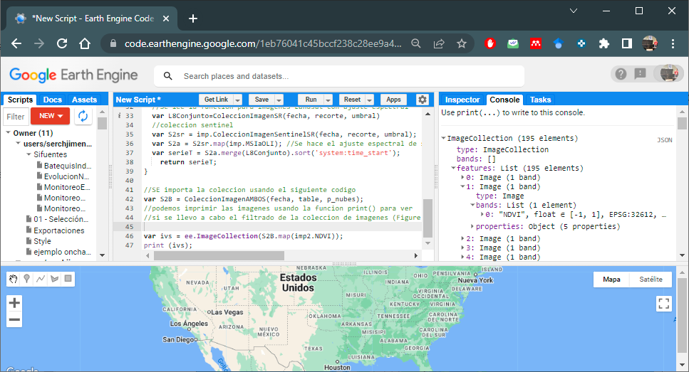
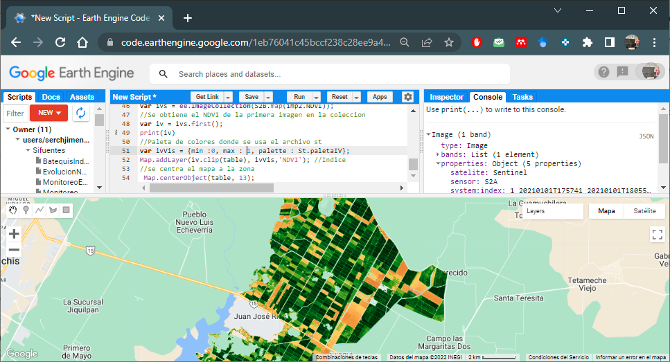

# VICAL en GEE

En esta sección se muestra cómo usar los archivos de VICAL para implementarlos en un script propio de GEE. 

VICAL cuenta con tres archivos que puede importar a su Script, estos son: 

```{js }
// archivo para las colecciones de imagenes);
var imp = require('users/InifapCenidRaspa/VICAL:Exportaciones');
// archivo para los indices de vegetacion
var imp2= require('users/InifapCenidRaspa/VICAL:VegetationIndex'); 
// archivo para las visualizaciones
var St= require('users/InifapCenidRaspa/VICAL:Style');

```

## Coleccion de imagenes {#CImg}
Antes de importar el conjunto de colecciones de imágenes se deben definir ciertas variables que van a ser útiles para filtrar la colección, estos son: i) un punto o polígono; ii) intervalo de fechas y iii) valor umbral de nubes en las imágenes; esto se muestra a continuación: 
```{js }
var fecha = ['2021-01-01', '2022-03-18']; //Fecha inicial y final 
//poligono o punto
var table = ee.FeatureCollection("projects/calcium-verbena-328905/assets/Bate"); 
var p_nubes= 30;//Porcentaje de nubes
```

### Landsat
Si se desea usar imágenes LandSat (4, 5, 7, 8 y 9) corregidas atmosféricamente libre de nubes se puede usar el código siguiente, donde se crea una función para unir las colecciones de imágenes. Para ello se usa el archivo **_imp_**. 
```{js }
function ColeccionImagenSR(fecha, recorte, umbral)
{
  // se importan las colecciones de imagenes usando el archivo "imp"
  var L9sr = imp.ColeccionLandsatSR(fecha, 'LC09', recorte, umbral);
  var L8sr = imp.ColeccionLandsatSR(fecha, 'LC08', recorte, umbral);
  var L7sr = imp.ColeccionLandsatSR(fecha, 'LE07', recorte, umbral);
  var L5sr = imp.ColeccionLandsatSR(fecha, 'LT05', recorte, umbral);
  var L4sr = imp.ColeccionLandsatSR(fecha, 'LT04', recorte, umbral);
  //Los datos de ETM y ETM+ se ajustan espectrales a OLI y OLI-2 
  var L7a = L7sr.map(imp.TMaOLI);
  var L5a = L5sr.map(imp.TMaOLI);
  var L4a = L4sr.map(imp.TMaOLI);
  // Une las tres series de imágenes
  var serieT =L9sr.merge(L8sr).merge(L7a).merge(L5a).merge(L4a).sort('system:time_start');
	return serieT;
}
//SE importa la coleccion usando la funccion anterior 
var l8Sergio=ColeccionImagenSR(fecha, table, p_nubes);
//podemos imprimir las imagenes usando la funcion print() para ver 
//si se llevo a cabo el filtrado de la coleccion de imagenes (Figura 6.1) 
print (l8Sergio);

```

Con estas colecciones de imágenes se pueden calcular series de tiempo de diferentes índices de vegetación.

```{r figV1, fig.cap='Impresion de coleccion de imagenes Landsat',echo=FALSE, out.width="85%", message=FALSE, warning=FALSE, fig.align = 'center'}
knitr::include_graphics("./images/Figure70.png")
```

### Sentinel-2
Si se desea usar imágenes Sentinel-2 corregidas atmosféricamente libre de nubes se puede usar el siguiente código.
```{js }
//SE importa la coleccion usando el siguiente codigo
var S2sr = imp.ColeccionImagenSentinelSR(fecha, table, p_nubes);
//podemos imprimir las imagenes usando la funcion print() para ver 
//si se llevo a cabo el filtrado de la coleccion de imagenes (Figura 6.2)
print (S2sr);
```

```{r figV2, fig.cap='Impresion de coleccion de imagenes Sentinel-2',echo=FALSE, out.width="85%", message=FALSE, warning=FALSE, fig.align = 'center'}
knitr::include_graphics("./images/Figure71.png")
```


### Landsat y Sentinel-2 {#LanSen}
Si se desea usar imágenes LandSat y Sentinel-2 corregidas atmosféricamente libre de nubes se puede usar el siguiente código, los datos se ajustaron espectralmente a las bandas espectrales de Landsat 8. Se emplean las funciones descritas en la Sección \@ref(CImg):
```{js }
function ColeccionImagenAMBOS(fecha, recorte, umbral)
{
  //Se lee la function para imagenes Landsat con ajuste espectral
  var L8Conjunto=ColeccionImagenSR(fecha, recorte, umbral)
  //coleccion sentinel
  var S2sr = imp.ColeccionImagenSentinelSR(fecha, recorte, umbral);
  var S2a = S2sr.map(imp.MSIaOLI); //Se hace el ajuste espectral de sentinel-2 a Landsat
  var serieT = S2a.merge(L8Conjunto).sort('system:time_start');
	return serieT;
}

//SE importa la coleccion usando el siguiente codigo
var S2B = ColeccionImagenAMBOS(fecha, table, p_nubes);
//podemos imprimir las imagenes usando la funcion print() para ver 
//si se llevo a cabo el filtrado de la coleccion de imagenes (Figura 6.3)
print (S2sr);

```

```{r figV3, fig.cap='Impresion de coleccion de imagenes Landsat y Sentinel-2',echo=FALSE, out.width="85%", message=FALSE, warning=FALSE, fig.align = 'center'}
knitr::include_graphics("./images/Figure72.png")
```

Para revisar un Script de ejemplo clic [aquí](https://code.earthengine.google.com/1eb76041c45bccf238c28ee9a4bad955)

## Indices de vegetación 
Para usar el código de índices de vegetación de **VICAL** se tienen que usar el archivo **imp2**; y se mandan a llamar estos IV usando los nombres de la columna **ExpresionGEE** que se muestran en la **Tabla \@ref(tab:Index)**.

Por ejemplo, para calcular el NDVI con la colección de imágenes LandSat y Sentinel-2 de la sección \@ref(LanSen) se usaría el siguiente código:

```{js }
//Normalized Difference Vegetation Index- NDVI
var ivs = ee.ImageCollection(S2B.map(imp2.NDVI));
//para imprimir y ver la banda de NDVI
print (ivs);
```

En la Figura \@ref(fig:figV4) se muestra que en la colección de imágenes del conjunto armonizado aparece una sola banda que se llama **NDVI**.
```{r figV4, fig.cap='Impresion de coleccion de imagenes con banda NDVI', echo=FALSE, out.width="85%", message=FALSE, warning=FALSE, fig.align = 'center'}

```

Ahora, para visualizar en el mapa el **NDVI** de la primera imagen de la colección y recortado para la zona quedaría como se muestra en el código siguiente; donde para ver la paleta de colores se utilizaría el archivo **st ** de ¨**VICAL**.  
```{js }
//Se obtiene el NDVI de la primera imagen en la coleccion 
var iv = ivs.first();
//Paleta de colores donde se usa el archivo st
var ivVis = {min :0, max : 1, palette : St.paletaIV};
Map.addLayer(iv.clip(table), ivVis,'NDVI'); //Indice
//se centra el mapa a la zona
 Map.centerObject(table, 13);
```
En la Figura \@ref(fig:figV6). se muestra el mapa de NDVI para la zona de interés.

```{r figV6, fig.cap='mapa de NDVI para el area de interes', echo=FALSE, out.width="85%", message=FALSE, warning=FALSE, fig.align = 'center'}

```
Para revisar el codigo del ejemplo clic [aquí](https://code.earthengine.google.com/299b022150c4569d006b323931f8d828)

Si se desea visualizar el NDVI de una imagen en particular se debe convertir a lista de después mandar a llamarlo. 

```{r  Index, echo=FALSE, message=FALSE, warning=FALSE,}
Numero<-c(	"1",	"2",	"3",	"4",	"5",	"6",	"7",	"8",	"9",	"10",	"",	"11",	"12",	"13",	"14",	"15",	"16",	"17",	"18",	"19",	"20",	"21",	"22",	"23")
Indice<-c("Atmospherically resistant vegetation index",	"Adjusted transformed soil-adjusted vegetation index",	"Difference vegetation index",	"Enhanced vegetation index",	"Enhanced vegetation index",	"Green normalized difference vegetation index",	"Modified soil adjusted vegetation index",	"Moisture stress index",	"Modified triangular vegetation index",	"Modified triangular vegetation index-2",	"",	"Normalized difference tillage index (NDTI)",	"Normalized difference vegetation index",	"Normalized difference water index",	"Optimized soil adjusted vegetation index",	"Renormalized difference vegetation index",	"Redness index",	"Ratio vegetation index",	"Soil adjusted vegetation index",	"Triangular vegetation index",	"Transformed soil adjusted vegetation index",	"Visible atmospherically resistant index",	"Vegetation index number or simple ratio",	"Wide dynamic range vegetation index")
Abreviatura<-c("ARVI*",	"ATSAVI*",	"DVI",	"EVI",	"EVI2*",	"GNDVI",	"MSAVI2",	"MSI",	"MTVI",	"MTVI2",	"",	"NDTI",	"NDVI",	"NDWI",	"OSAVI*",	"RDVI",	"RI",	"RVI",	"SAVI*",	"TVI",	"TSAVI*",	"VARI",	"VIN",	"WDRVI*")
ExpresionGEE<-c("ARVI",	"ATSAVI",	"DVI",	"EVI",	"EVI2",	"GNDVI",	"MSAVI2",	"MSI",	"MTVI",	"MTVI2",	"",	"NDTI",	"NDVI",	"NDWI",	"OSAVI",	"RDVI",	"RI",	"RVI",	"SAVI",	"TVI",	"TSAVI",	"VARI",	"VIN",	"WDRVI")
Coeficientes<-c("γ=1.0",	"",	"",	"C1=6.0, C2= 7.5; L=1.0",	"C1=2.4",	"",	"",	"",	"",	"",	"",	"",	"",	"",	"X=0.16",	"",	"",	"",	"L=0.5",	"",	"a= 1 ; b=0; ",	"",	"",	"α=0.2")
Index<-data.frame(Numero, Indice, Abreviatura, ExpresionGEE,Coeficientes)

knitr::kable(
  Index, booktabs = TRUE, align = "lcccc",
  caption = 'Codigo de indices de vegetación considerados en VICAL'
)
```
